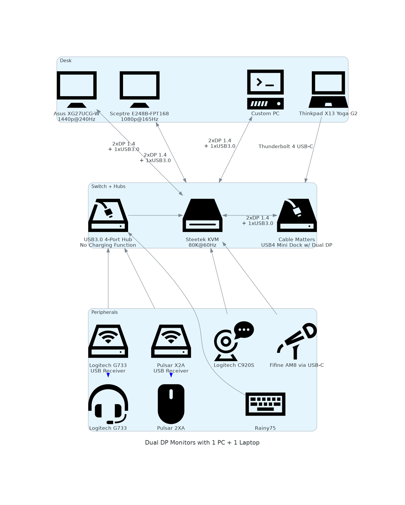

# KVM Setup Dual Displays with 1 PC + 1 Laptop
## A solution for home office users with two devices and way too many peripherals

### The Problem

When I started WFH, I was constantly swapping cables from my home PC to my work laptop trying to use the personally curated selection of peripherals I already had. Instead of buying another keyboard, mouse, etc. and creating a separate workspace, I needed a solution that would make this switch between my PC and laptop frictionless, (within a reasonable budget).

### My Solution
Here is a diagram of my setup:
<picture>
  <source srcset="./kvm_setup.png" width=50%>
  
</picture>

This diagram was made using [Diagrams as Code](https://diagrams.mingrammer.com/)
[View the full script](main.py)

### Devices & Peripherals
I needed to stitch together the following devices and their interfaces:
* Custom PC - Gigabyte Vision OC RTX3080 (3 DisplayPort 1.4 & 2 HDMI 2.1 ports)
* Laptop - Thinkpad X13 Yoga Gen 2 (Thunderbolt4 USB-C)
* Webcam - Logitech C390S (USB3.0 Type A)
* Microphone - Fifine AM8 (USB3.2 Type C)
* Keyboard - Rainy75 (USB3.0 Type A)
* Headset - Logitech G733 (USB2.0 Type A Dongle)
* Mouse - Pulsar X2A (USB2.0 Type A Dongle)

### Research
Naturally you'd think to find an all-in-one device to keep costs low. Turns out, it's actually way more expensive to buy a device that is capable of retaining maximum performance of dual monitors, supporting the exact interfaces you have and keep display resolution and settings intact between switching. Actually, goodluck finding a device that is able to have all of these features. More than likely, some features need to be cut in order to keep another. 

My best bet was a KVM (Keyboard, Video, Mouse) switch. A KVM switch allows you to switch between using two or more devices while still retaining the ability to use the same set of peripherals.

My final setup was heavily inspired by [ConnectPRO's Guide](https://www.connectpro.com/blogs/news/the-ultimate-kvm-switch-setup-for-dual-monitor-sharing-with-one-mac-and-one-pc-system). 

### Requirements
* Support Dual DisplayPort 1.4
* Simultaneously handle 1440p@240Hz & 1080p@165Hz
* EDID emulation (more on that later)
* Enough ports for at least 4 USB devices (keyboard, mouse, microphone, webcam)
* Support TB4 connection to laptop